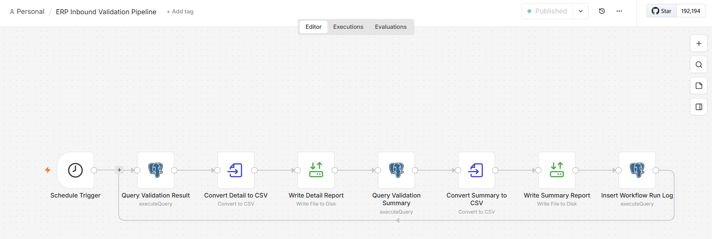
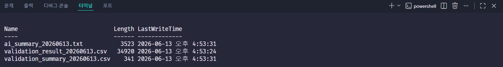
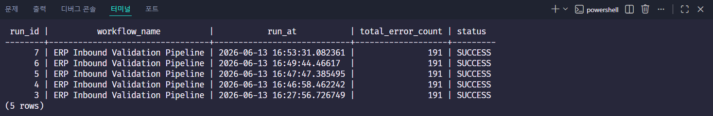
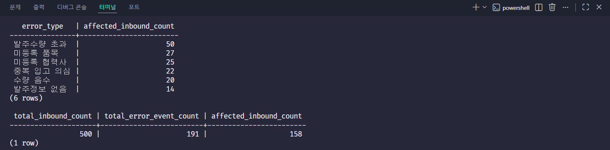
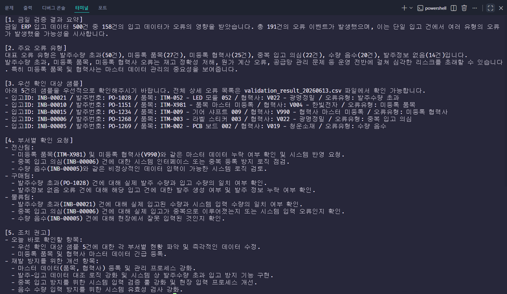

# ERP Inbound Validation Pipeline

## 1. 프로젝트 한 줄 소개

n8n, PostgreSQL, Docker Compose, Gemini API를 활용하여 **ERP 입고 데이터의 정합성 오류를 자동 검증하고, CSV 리포트와 AI 요약 리포트를 생성하는 업무 자동화 파이프라인**입니다.

---

## 2. 사용 기술

| Category            | Stack                  |
| ------------------- | ---------------------- |
| Workflow Automation | n8n                    |
| Database            | PostgreSQL             |
| Container           | Docker, Docker Compose |
| Query               | SQL                    |
| AI Summary          | Gemini API             |
| Version Control     | Git, GitHub            |

---

## 3. 워크플로우 구조

```text
Schedule Trigger
→ Query Validation Result
→ Convert Detail to CSV
→ Write Detail Report
→ Query Validation Summary
→ Convert Summary to CSV
→ Write Summary Report
→ Insert Workflow Run Log

Write Detail Report
→ Query AI Report Payload
→ Generate AI Summary with Gemini
→ Extract AI Summary Text
→ Convert AI Summary to TXT
→ Write AI Summary Report
```

워크플로우는 매일 정해진 시간에 실행되며, PostgreSQL에서 ERP 입고 데이터를 검증한 뒤 상세 CSV, 요약 CSV, AI 요약 TXT 리포트를 생성합니다.

---

## 4. 핵심 기능

### 4.1 ERP 입고 데이터 검증

입고 데이터, 발주 데이터, 품목 마스터, 협력사 마스터를 기준으로 정합성 오류를 검증합니다.

검증 룰은 다음과 같습니다.

| Error Type | Description                                       |
| ---------- | ------------------------------------------------- |
| 수량 음수      | 입고 수량이 0보다 작은 경우                                  |
| 발주수량 초과    | 입고 수량이 발주 수량보다 많은 경우                              |
| 미등록 품목     | 품목 마스터에 존재하지 않는 품목 코드                             |
| 미등록 협력사    | 협력사 마스터에 존재하지 않는 협력사 코드                           |
| 발주정보 없음    | 발주번호와 품목 조합이 발주 데이터에 없는 경우                        |
| 중복 입고 의심   | 동일 입고일, 발주번호, 품목, 협력사, 수량이 모두 같은 데이터가 여러 번 등록된 경우 |

---

### 4.2 상세 리포트와 요약 리포트 분리

리포트는 목적에 따라 분리했습니다.

| Report | Description                          |
| ------ | ------------------------------------ |
| 상세 리포트 | 모든 오류 이벤트를 보존한 CSV 리포트               |
| 요약 리포트 | 입고 건당 대표 오류 1개 기준으로 집계한 CSV 리포트      |
| AI 리포트 | 요약 통계와 우선 확인 샘플 5건을 기반으로 생성한 자연어 리포트 |

하나의 입고 건이 여러 오류에 동시에 걸릴 수 있기 때문에, 상세 리포트에서는 전체 오류 이벤트를 보존하고 요약 리포트에서는 대표 오류 기준으로 집계했습니다.

---

### 4.3 AI 요약 리포트 생성

Gemini API를 활용하여 전산/ERP 운영 담당자용 자연어 리포트를 생성합니다.

AI 리포트에는 전체 제품명을 모두 나열하지 않고, 다음 정보만 요약합니다.

* 전체 입고 데이터 수
* 영향 입고 건수
* 오류 이벤트 수
* 대표 오류 유형별 요약
* 우선 확인 대상 샘플 5건
* 전산팀 / 구매팀 / 물류팀별 확인 요청
* 당일 조치 항목 및 재발 방지 개선안

전체 상세 오류 목록은 별도 CSV 파일에서 확인할 수 있도록 분리했습니다.

---

### 4.4 실행 로그 저장

워크플로우 실행 결과는 PostgreSQL의 `workflow_run_log` 테이블에 저장됩니다.

저장 항목은 다음과 같습니다.

| Column              | Description  |
| ------------------- | ------------ |
| run_id              | 실행 로그 ID     |
| workflow_name       | 워크플로우 이름     |
| run_at              | 실행 시각        |
| detail_report_path  | 상세 리포트 저장 경로 |
| summary_report_path | 요약 리포트 저장 경로 |
| total_error_count   | 총 오류 이벤트 수   |
| status              | 실행 상태        |

---

## 5. 결과 요약

500건의 ERP 입고 샘플 데이터를 기준으로 검증한 결과는 다음과 같습니다.

```text
전체 입고 데이터: 500건
오류 이벤트 수: 191건
영향 입고 건수: 158건
```

`영향 입고 건수`는 하나 이상의 오류가 발생한 고유 입고 건수입니다.
`오류 이벤트 수`는 한 입고 건이 여러 검증 룰에 동시에 걸린 경우를 모두 포함한 전체 오류 발생 수입니다.

대표 오류 기준 요약 결과는 다음과 같습니다.

```text
발주수량 초과: 50건
미등록 품목: 27건
미등록 협력사: 25건
중복 입고 의심: 22건
수량 음수: 20건
발주정보 없음: 14건
```

생성되는 리포트 파일은 다음과 같습니다.

```text
validation_result_YYYYMMDD.csv
validation_summary_YYYYMMDD.csv
ai_summary_YYYYMMDD.txt
```
실행 결과 예시는 `docs/sample_outputs/` 폴더에서 확인할 수 있습니다.

---

## 6. 실행 방법

### 6.1 프로젝트 실행

프로젝트 루트에서 Docker Compose를 실행합니다.

```bash
docker compose up -d
```

n8n 접속 주소:

```text
http://localhost:5678
```

---

### 6.2 PostgreSQL 접속 정보

n8n에서 PostgreSQL Credential을 설정할 때 아래 정보를 사용합니다.

```text
Host: erp_postgres
Port: 5432
Database: erp_db
User: erp_user
Password: erp_pass
SSL: Disable
```

---

## 7. 주요 캡처 이미지

### 7.1 n8n 전체 워크플로우



---

### 7.2 생성된 리포트 파일



---

### 7.3 워크플로우 실행 로그



---

### 7.4 검증 결과 요약



---

### 7.5 AI 요약 리포트 결과


