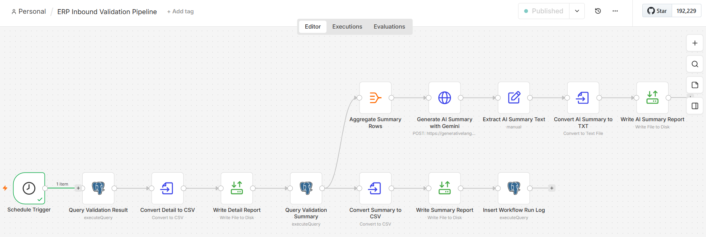
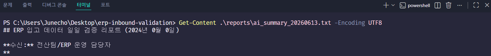

# ERP Inbound Validation Pipeline

n8n, PostgreSQL, Gemini API를 활용한 **ERP 입고 데이터 검증 및 AI 리포트 자동화 파이프라인**입니다.

입고 데이터의 정합성을 SQL 기반 검증 룰로 자동 점검하고, 오류 상세 리포트와 요약 리포트를 날짜별 CSV 파일로 생성합니다. 또한 Gemini API를 연동하여 전산/ERP 운영 담당자가 바로 확인할 수 있는 자연어 요약 리포트를 자동 생성하도록 구성했습니다.

---

## 1. Project Overview

이 프로젝트는 ERP 입고 데이터에서 발생할 수 있는 데이터 오류를 자동으로 탐지하고, 그 결과를 리포트화하는 업무 자동화 워크플로우입니다.

기존 수작업 방식에서는 담당자가 입고 데이터, 발주 데이터, 품목 마스터, 협력사 마스터를 직접 비교해야 합니다. 본 프로젝트에서는 이 과정을 n8n 워크플로우와 PostgreSQL 검증 쿼리로 자동화했습니다.

주요 목적은 다음과 같습니다.

* ERP 입고 데이터 정합성 자동 검증
* 반복적인 수작업 검증 업무 자동화
* 오류 상세 내역 및 요약 리포트 자동 생성
* Gemini API 기반 자연어 검증 리포트 생성
* 워크플로우 실행 이력 DB 저장

---

## 2. Tech Stack

| Category            | Stack       |
| ------------------- | ----------- |
| Workflow Automation | n8n         |
| Database            | PostgreSQL  |
| Container           | Docker      |
| Query               | SQL         |
| AI Summary          | Gemini API  |
| Version Control     | Git, GitHub |

---

## 3. Workflow Architecture

전체 워크플로우는 아래와 같이 구성되어 있습니다.

```text
Schedule Trigger
→ Query Validation Result
→ Convert Detail to CSV
→ Write Detail Report
→ Query Validation Summary
   ├→ Convert Summary to CSV
   │  → Write Summary Report
   │  → Insert Workflow Run Log
   └→ Aggregate Summary Rows
      → Generate AI Summary with Gemini
      → Extract AI Summary Text
      → Convert AI Summary to TXT
      → Write AI Summary Report
```

### n8n Workflow


---

## 4. Main Features

### 4.1 Scheduled Workflow Execution

n8n의 Schedule Trigger를 사용하여 매일 오전 9시에 입고 데이터 검증 워크플로우가 자동 실행되도록 구성했습니다.

```text
Trigger: Every day at 09:00
Timezone: Asia/Seoul
```

---

### 4.2 SQL-based Data Validation

PostgreSQL에서 ERP 입고 데이터의 정합성을 검증하는 SQL View를 생성했습니다.

검증 대상 데이터는 다음과 같습니다.

* 입고 데이터
* 발주 데이터
* 품목 마스터
* 협력사 마스터

주요 검증 룰은 다음과 같습니다.

| Validation Rule | Description                  |
| --------------- | ---------------------------- |
| 수량 음수           | 입고 수량이 0보다 작은 경우             |
| 발주수량 초과         | 입고 수량이 발주 수량보다 많은 경우         |
| 미등록 품목          | 품목 마스터에 존재하지 않는 품목 코드        |
| 미등록 협력사         | 협력사 마스터에 존재하지 않는 협력사 코드      |
| 발주정보 없음         | 발주번호와 품목 조합이 발주 데이터에 없는 경우   |
| 중복 입고 의심        | 동일 발주번호와 품목 조합으로 여러 번 입고된 경우 |

---

### 4.3 Report File Generation

검증 결과는 날짜별 파일로 자동 저장됩니다.

생성되는 리포트는 다음과 같습니다.

```text
validation_result_YYYYMMDD.csv
validation_summary_YYYYMMDD.csv
ai_summary_YYYYMMDD.txt
```

* `validation_result_YYYYMMDD.csv`: 오류 상세 내역
* `validation_summary_YYYYMMDD.csv`: 오류 유형별 요약
* `ai_summary_YYYYMMDD.txt`: Gemini API 기반 자연어 요약 리포트

### Generated Report Files


---

### 4.4 AI Summary Report with Gemini API

오류 유형별 요약 데이터를 Gemini API에 전달하여 전산 담당자용 자연어 리포트를 생성했습니다.

AI 리포트는 다음 항목을 포함합니다.

* 금일 검증 결과 요약
* 주요 오류 유형
* 우선 확인 대상
* 예상 원인
* 조치 권고

AI는 데이터 검증 자체를 수행하지 않고, SQL 검증 결과를 바탕으로 담당자가 이해하기 쉬운 리포트를 작성하는 역할로 사용했습니다.

### Gemini AI Summary Workflow



### AI Summary Report Result



---

### 4.5 Workflow Run Logging

워크플로우 실행 결과는 PostgreSQL의 `workflow_run_log` 테이블에 저장됩니다.

저장 항목은 다음과 같습니다.

| Column              | Description  |
| ------------------- | ------------ |
| run_id              | 실행 로그 ID     |
| workflow_name       | 워크플로우 이름     |
| run_at              | 실행 시각        |
| detail_report_path  | 상세 리포트 저장 경로 |
| summary_report_path | 요약 리포트 저장 경로 |
| total_error_count   | 총 오류 건수      |
| status              | 실행 상태        |

### Workflow Run Log


---

## 5. Validation Summary Example

오류 유형별 요약 결과 예시는 다음과 같습니다.


예시 결과:

```text
중복 입고 의심: 4건
발주수량 초과: 2건
발주정보 없음: 2건
미등록 품목: 1건
미등록 협력사: 1건
수량 음수: 1건
```

---

## 6. Project Structure

```text
erp-inbound-validation-pipeline/
├── docs/
│   └── screenshots/
│       ├── 01_n8n_workflow.png
│       ├── 02_generated_report_files.png
│       ├── 03_workflow_run_log.png
│       ├── 04_validation_summary_result.png
│       ├── 05_gemini_ai_summary_workflow.png
│       └── 06_ai_summary_report_result.png
├── n8n_workflows/
│   └── inbound_validation_pipeline.json
├── sql/
│   └── 01_setup_sample_db.sql
├── .gitignore
└── README.md
```

---

## 7. Database Setup

샘플 DB 생성 및 검증 View 생성을 위해 아래 SQL 파일을 사용합니다.

```text
sql/01_setup_sample_db.sql
```

해당 SQL 파일에는 다음 객체가 포함되어 있습니다.

* `item_master`
* `vendor_master`
* `purchase_orders`
* `inbound_orders`
* `validation_result`
* `workflow_run_log`

---

## 8. n8n Workflow Import

n8n에서 아래 파일을 Import하여 워크플로우를 복원할 수 있습니다.

```text
n8n_workflows/inbound_validation_pipeline.json
```

Import 후 필요한 설정은 다음과 같습니다.

1. PostgreSQL Credential 설정
2. Gemini API Key 설정
3. `/files/reports` 경로 확인
4. Schedule Trigger 시간 확인
5. 워크플로우 Publish

---

## 9. Security Notes

Gemini API Key는 GitHub에 업로드하지 않습니다.

워크플로우 JSON 파일 내 API Key는 아래와 같은 placeholder로 대체해야 합니다.

```text
YOUR_GEMINI_API_KEY
```

자동 생성되는 리포트 파일은 `.gitignore`로 제외했습니다.

```gitignore
reports/*.csv
reports/*.xlsx
reports/*.txt
```

---

## 10. What I Learned

이 프로젝트를 통해 다음 역량을 구현했습니다.

* n8n 기반 업무 자동화 워크플로우 설계
* PostgreSQL 기반 데이터 정합성 검증
* SQL View를 활용한 검증 로직 구조화
* Docker 기반 로컬 개발 환경 구성
* Gemini API 연동
* 자동 리포트 생성 및 파일 저장
* 워크플로우 실행 로그 관리
* GitHub 기반 포트폴리오 문서화

---

## 11. Portfolio Summary

본 프로젝트는 ERP 입고 데이터 검증 업무를 자동화한 데이터 운영 자동화 파이프라인입니다.

SQL 기반 검증 룰을 통해 입고 데이터의 오류를 탐지하고, n8n을 통해 상세 리포트와 요약 리포트를 자동 생성했습니다. 또한 Gemini API를 연동하여 전산 담당자가 바로 확인할 수 있는 자연어 요약 리포트를 생성하도록 구현했습니다.

이를 통해 단순 데이터 조회를 넘어, 업무 데이터 검증, 자동화, AI 리포트 생성, 실행 로그 관리까지 포함한 실무형 자동화 흐름을 구성했습니다.
